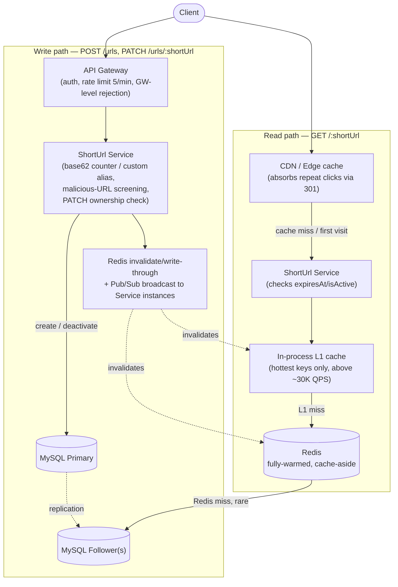

# Problem statement

Design Url shortener app

## Scope and Requirements

* Expiration : assuming url will have expiry date — default TTL of 1 year from creation if the user doesn't set one, with an optional custom expiry at creation time
* Skew load : traffic across URLs is skewed (a small number of URLs — e.g. a viral link — get most of the reads). This does NOT mean the platform's total QPS depends on per-URL uniformity; it means the *distribution* of that QPS across URLs is uneven, which is a caching/hot-key concern for the Scalability section, not a scope-math concern here.
* Rate limiting : should be on write api.

## Functional requirements

* Client will come to platform and generate short url against the original url
* Customer will hit the short url and platform will redirect them to original url
* Custom alias (vanity URLs): in scope
* Deactivate a link: in scope
* Redirect type: 301 (permanent). Tradeoffs accepted with this choice:
  * No reliable click analytics — a 301 is cached by the browser/CDN, so repeat visits from the same client resolve locally and never reach our server. We can at best undercount (first-hit-per-client only), not track true click volume.
  * Deactivation is not guaranteed for clients that already cached the 301 — they'll keep redirecting to the old destination locally, unaware the link was deactivated server-side, until their cache expires.
  * Changing a short code's redirect target later is unreliable for the same caching reason.
  * Accepted because: fewer repeat hits reach our servers, which lowers real read load below the raw "click" count — cheaper to run at the scale we're targeting. If accurate analytics become a hard requirement later, revisit with 302 (or 301 + a separate analytics beacon).

## Quantified scale

* Writes: assume 1,000 new short URLs created per day.
* Reads: assume platform-wide average read QPS = 100,000 QPS. This is a *platform-wide average across all URLs combined* — it does not assume each URL gets equal traffic (see skew note above); it's just total reads/sec, however that load happens to be distributed.
* Read:write ratio (derived, stated explicitly): daily reads = 100,000 QPS × 86,400 s/day ≈ 8.64 × 10⁹ reads/day, vs 1,000 writes/day → read:write ≈ 8.64 × 10⁶ : 1. That's an extreme, very-viral-scale ratio (bit.ly-tier).
* Storage:
  * Assuming MySQL, single row = short url + original url + metadata ≈ 1 KB
  * Daily storage: 1 KB × 1,000 rows/day ≈ 1 MB/day
  * Yearly storage: 1 MB × 365 ≈ 365 MB/year
  * 10 years: 365 MB × 10 ≈ 3.65 GB
  * Simplification: ignores index overhead and assumes fixed row size.

## API endpoints

1. `POST /urls`
   * Header: 
     * Auth token --  Users are going to use FE dashboard to create shorten url and they need to login on the dashboard before they can use this feature. At the time of login, BE gives the token to FE which will be passed in the api call.
     * Rate limit -- 5 requests/min, scoped per authenticated user (tied to the login token, not global) — enforced at the `GW` layer so an abusive caller is rejected before reaching the ShortUrl Service. Exceeding it returns `429 Too Many Requests`.
     * Malicious-URL screening -- synchronous check against a safe-browsing/URL-reputation API (e.g. Google Safe Browsing) at creation time, before the row is written; rejected with an error response if flagged. Acceptable to do synchronously since this only affects the write path (1,000/day), not the read-heavy path. Known limitation: this only screens the URL at creation time — a destination that's benign at creation but turns malicious later (TOCTOU) isn't caught; out of scope for v1, flagged here rather than silently ignored.
   * Request body: `{ "url": "www.test.com/....", "customAlias": "optional-string" }`
   * Response body: `{ "shortUrl": "" }`, or `409 Conflict` if `customAlias` is already taken
2. `GET /{shortUrl}` — no `/urls` prefix. The redirect path IS the short code; a `/urls/` prefix wastes characters on the one URL that's supposed to be short.
3. `PATCH /urls/{shortUrl}` with body `{ "isActive": false }` — renamed from DELETE, since this is a soft deactivation (flips `isActive`), not row removal. The row and its history stay queryable/recoverable. Authorization: the token's user id must match the link's `createdBy`, else `403 Forbidden` — only the creator can deactivate their own link.

## Short code generation

### Option 1: Hash generation

* Approach: hash the long URL (e.g. MD5/SHA-256), truncate to 6 base62 characters for the short code.
* Problem, quantified: the 62⁶ ≈ 56.8 billion space looks comfortably large next to ~3.65M codes over 10 years (Quantified Scale) — but truncated-hash collisions follow the birthday paradox, not a simple "codes ÷ space" ratio. Using the standard approximation P(collision) ≈ 1 − e^(−n²/2m):
  * At n ≈ 280,000 codes generated (~1/13th of the 10-year total) — m = 62⁶ ≈ 5.68 × 10¹⁰ — collision probability is already ≈ 50%.
  * At n ≈ 3.65M (the full 10-year volume), n²/2m ≈ 117 — collision probability is indistinguishable from 100%. A collision isn't a tail risk here, it's a near-certainty well before year 10.
* Consequence: this option needs real collision-handling — detect via the DB unique constraint, then retry with a different hash input (e.g. re-hash with a salt/nonce) or fall back to a longer code. That's retry-loop complexity and an unbounded-in-the-worst-case write latency, which Option 2 avoids entirely by construction (a counter can't collide with itself).

### Option 2: Base62-encoded auto-increment counter (Chosen option)

* Rejected ULID: 26 characters is not a short URL — defeats the requirement.
* Rejected "ties to MySQL" as a reason to avoid the counter: at 1,000 writes/day, a single auto-increment source isn't a bottleneck. The earlier objection was a generic distributed-systems instinct that doesn't apply at this stated scale.
* 6 base62 chars (`[0-9a-zA-Z]`) = 62⁶ ≈ 56.8 billion combinations, against ~3.65M codes generated over 10 years at this write rate — comfortably sufficient, no collision handling needed since the counter guarantees uniqueness.
* Custom alias uses the same `shortUrl` column/namespace; uniqueness enforced by a DB unique constraint, checked at insert time — collision surfaces as `409 Conflict` on the API (see above).

## Data model

* `shortUrl` (PK, base62 code or custom alias), `longUrl`, `createdBy`, `updatedBy`, `createdAt`, `updatedAt`, `expiresAt`, `isActive`
* `expiresAt` — matches the "url will have an expiry date" assumption in Scope (default 1 year from `createdAt` unless the user sets a custom value). Checked lazily at redirect time (an expired row is treated as inactive even if `isActive` is still true) rather than requiring a cron sweep — cheap to check on every read, and correctness doesn't depend on a background job running on schedule. An optional periodic cleanup job can flip `isActive` for expired rows for housekeeping, but isn't required for correctness.
* `createdBy` / `updatedBy` populated from the auth token's user id — this is what the `PATCH` authorization check (API endpoints) compares against.

## Major components

* Write path: `Client → GW → ShortUrl Service → DB` (generates base62 code from counter, or validates+inserts custom alias)
* Read path: `Client → CDN/edge cache → ShortUrl Service → Redis (cache-aside) → DB (on miss)`
  * CDN/edge layer added: since redirects are 301 (permanent/cacheable), most repeat traffic from a given client resolves at the edge or in the browser and never reaches our infrastructure at all — this is the direct payoff of the 301 decision, and the main reason the real request volume hitting the service is far below the raw 8.64B/day click count.
  * Redis cache-aside: on deactivation (`PATCH`), explicitly invalidate/delete the Redis entry so the change takes effect promptly rather than waiting out a TTL — a TTL-only approach would let deactivated links keep resolving from cache for up to the TTL window.

### Why MySQL

The access pattern itself (`shortUrl → longUrl`, single-key lookup, no joins) doesn't require relational structure — a key-value store would fit that alone. MySQL is chosen instead because:

* Custom alias needs a straightforward uniqueness guarantee at write time — a unique index + insert-time constraint is simple and well-understood in a relational DB.
* MySQL only needs to serve cache misses + 1,000 writes/day, not the raw 100K QPS average — Redis (plus the CDN layer above) absorbs nearly all read traffic, which is what actually makes MySQL viable here despite not being the "natural" fit for pure key-value access.
* Master-follower replication handles the read-miss + write split; it doesn't need to defend against hot-key skew directly, since hot keys are cache hits, not DB hits.

### Scalability & Performance

* **Peak vs average**: average platform QPS is 100K (from Quantified Scale). Assume peak = 5x average during a viral spike ≈ 500,000 QPS raw clicks/sec. All capacity numbers below are checked against peak, not average.

* **301 traffic-reduction, quantified — and where it breaks down**: baseline assumption is that ~90% of daily clicks are repeat visits absorbed at the browser/CDN edge, so only ~10% of raw clicks reach our origin during steady state (origin QPS ≈ 10% × 100K ≈ 10,000 QPS avg). *However*, a viral spike is dominated by distinct first-time visitors, not repeat clicks from the same person — so edge caching provides little protection during exactly the scenario we're worried about. Worst-case assumption during a spike: ~80% first-touch ⇒ origin QPS during spike ≈ 80% × 500,000 = 400,000 QPS. 301 caching and hot-key risk are two different problems and shouldn't be conflated — 301 helps steady-state repeat load, not viral spikes.

* **Hot-key check (the skew assumption from Scope, resolved here)**: stated skew model — assume the single hottest URL can account for up to 5% of platform traffic during a spike. At peak origin QPS of 400,000, that's ≈ 20,000 QPS hitting one Redis key. A single-threaded Redis node handles roughly 100K-150K ops/sec in practice, so 20K QPS on one key has ~5-7x headroom — fine at this stated scale. If the skew concentration or peak multiplier were higher (e.g. one URL taking 20%+ of peak traffic), this would exceed a single node's ceiling — since Redis Cluster shards by key, more nodes don't help a single hot key. The escalation lever in that case: an in-process L1 cache in the ShortUrl Service for the top-N hottest keys, ahead of the Redis hop, to shave that specific key's QPS before it reaches the network at all. Not needed at current numbers, but naming the lever for when the assumption changes.

* **Cache sizing — the whole dataset fits in memory**: total 10-year storage is ~3.65 GB (from Quantified Scale). That comfortably fits entirely in a modestly-sized Redis cluster's RAM — not just a hot subset. Implication: instead of pure cache-aside with LRU eviction, warm the entire dataset (e.g. backfill on deploy, plus write-through on creation) so effectively every read is a cache hit by construction. The only real "miss" case is the brief window between a new URL being written and its cache entry being populated — handled by write-through on creation rather than waiting for a read-triggered fill.

* Write traffic (1,000/day) doesn't need partitioning; DB partitioning by short code remains available if write volume grows by orders of magnitude.

* Read traffic is served from Redis at low-single-digit-millisecond latency; DB is only in the path for the write-through on creation and the rare fallback described above.

* Redundancy (Redis replicas, MySQL replicas) for instance failure is a Reliability & Consistency concern — carried forward, addressed in that section rather than duplicated here.

## Reliability & Consistency

**Consistency model** — explicit, not assumed:

* MySQL is the strongly-consistent source of truth for `shortUrl → longUrl` mappings; a single primary handles all writes (creation, deactivation).
* Redis is an eventually-consistent cache of that source of truth — but because we write-through on creation and explicitly invalidate on deactivation (Scalability section), staleness in practice is bounded to "as fast as the invalidation call completes," not a lazy TTL window. This is closer to read-your-writes for both paths than to loose eventual consistency.
* A stale MySQL follower (replication lag) can only affect the rare cache-miss fallback path, since Redis serves the vast majority of reads — bounded, low-blast-radius staleness.

**Failure modes, per component**:

| Component | Failure | Effect | Mitigation |
|---|---|---|---|
| CDN/edge | Down | Traffic falls back to origin directly — sudden load spike on GW/Service | Origin tier sized with headroom for this (ties to the 5-7x hot-key headroom already established); CDN should have multi-region PoPs so a single-PoP failure doesn't take all edge caching down at once |
| API Gateway / LB | Instance down | Requests to that instance fail | Redundant, health-checked GW/LB instances — no single instance is load-bearing |
| ShortUrl Service | Instance down | Requests routed to it fail | Stateless service — horizontal scaling + health checks + LB removes it from rotation; no data loss since no state lives in the service itself |
| Redis primary | Down | Reads fall back to MySQL follower directly (existing fallback path) — origin load spikes toward the ~400K peak QPS case from Scalability until Redis recovers | Redis replica promoted automatically (Sentinel/Cluster failover); dataset is small (~3.65 GB) so a promoted replica or a cold rebuild-from-MySQL warms fast |
| Redis replica lag/partition | Stale reads from a lagging replica | A just-deactivated link could briefly still resolve as active from a stale replica | Acceptable bounded staleness; deactivation is not a safety-critical guarantee here (no requirement stated that demands instant global consistency) |
| MySQL primary | Down | All writes (creation, deactivation) fail until failover | Managed HA (e.g. automatic primary promotion, ~30-60s typical failover); low blast radius since writes are only ~1,000/day — a short write outage is tolerable, not an emergency |
| MySQL follower | Down | Cache-miss/write-through fallback path degrades to remaining followers | Multiple followers; not critical since Redis absorbs nearly all read load |

**Redundancy / failure domain**: assuming multi-AZ within a single region for both MySQL (primary + follower across AZs) and Redis (primary + replica across AZs) — no stated requirement for a globally-distributed user base, so multi-region is explicitly out of scope for now. If low-latency access from multiple continents became a requirement, this would need multi-region read replicas plus geo-routing at the CDN/DNS layer — naming it as the lever, not building it now.

**Idempotency**:

* `GET /{shortUrl}` (redirect) is a pure read — naturally idempotent, no concern.
* `PATCH /urls/{shortUrl}` (deactivation) is naturally idempotent — setting `isActive: false` twice has no different effect than once.
* `POST /urls` (creation) is the one at-least-once risk: if a client retries after a timeout without an idempotency key, a default (non-custom-alias) request mints a *second, different* short code for the same long URL on retry — wasteful but not a correctness bug (each code is independently valid). Custom-alias retries are accidentally protected by the unique constraint (retry hits `409` rather than duplicating). Recommend an `Idempotency-Key` header on `POST /urls` so retries return the original short code instead of minting a new one.

## Depth on the Hard Part

For this system, the genuinely hard sub-problem isn't storage or CRUD — it's **surviving a single URL going viral without violating latency, given a cache architecture that shards by key**. Short-code generation and cache sizing turned out to be simple once checked against the actual numbers (Short Code Generation, Scalability); this is the one place worth going a level deeper than the architecture diagram.

* **Detection, not a static threshold**: rather than permanently over-provisioning for the worst case, track per-key request rate at the Service layer with a sliding-window counter. When a single key crosses a threshold set with headroom below a Redis node's ceiling (e.g. ~30K QPS, against the ~100-150K single-node ceiling established in Scalability), promote that key into an in-process local cache (e.g. Caffeine) on each Service instance — shaving that key's traffic before it ever reaches the Redis network hop.
* **The subtlety this raises**: the keys most likely to need *urgent* deactivation (an abusive or infringing link) are, by nature, exactly the keys most likely to be under a viral spike and therefore promoted to local, per-instance caches. A TTL-only local cache would mean a "deactivated" link keeps resolving from scattered per-instance caches for the length of that TTL — undermining the one case where fast deactivation matters most.
* **Resolution**: deactivation (`PATCH`) publishes an invalidation event over Redis Pub/Sub (or an equivalent lightweight broadcast) to all Service instances, not just the shared Redis entry. Broadcasting to on the order of tens of instances is sub-second, so even with local-cache promotion active, deactivation propagation stays in the low-seconds range — the tradeoff (added invalidation-plumbing complexity) is accepted specifically because it closes the gap the naive local-TTL-cache approach would leave open.

## Tradeoffs

| Decision | Alternative(s) rejected | Why (tied to requirements/cost) |
|---|---|---|
| Redirect: 301 permanent | 302 temporary | 302 hits origin on every click (~8.64B/day). Illustrative compute cost at ~$0.20/million requests: 302 ≈ 8,640 × $0.20 ≈ $1,730/day (~$52K/month). 301 with ~90% edge absorption ≈ 864M/day origin hits ≈ $173/day (~$5K/month) — roughly a 10x difference. Rough numbers (provider/architecture-dependent), but the order of magnitude is what justifies accepting the lost analytics/instant-deactivation (Functional Requirements) |
| Short code: base62 counter | ULID; hash-of-URL | ULID (26 chars) fails the "short" requirement outright. Hash risks collisions needing detection/retry logic. Counter is simplest and collision-free, and the "ties to MySQL" objection doesn't hold at 1,000 writes/day |
| Datastore: MySQL | Pure key-value store (DynamoDB/Cassandra) | Checked the actual $ rather than assuming: at 1,000 writes/day (~30K/month), DynamoDB on-demand write cost (~$1.25/million writes) is under $1/month — cheaper in raw compute than a small always-on multi-AZ MySQL instance (~$100-300/month). So this is *not* actually a compute-cost win for MySQL; the real cost being avoided is operational — standing up, backing up, monitoring, and staffing on-call for a second distinct datastore technology when relational tooling is the default elsewhere. That's a real cost, just not a compute one — worth being precise about which cost actually drives the decision |
| Cache: fully-warmed, write-through | Cache-aside with LRU eviction | Entire 10-year dataset is ~3.65 GB — a small Redis node holding it fully (~$50-100/month illustrative) is cheap next to the complexity avoided (no eviction policy, no miss-path logic) |
| Consistency: single MySQL primary | Multi-primary / distributed-strong writes | Write volume is trivial (~0.01 QPS avg) — multi-primary complexity buys nothing here. Traded a theoretical SPOF for fast automatic failover (~30-60s), acceptable given the low blast radius |
| Hot-key mitigation: dynamic L1 promotion | Static over-provisioning of Redis/Service capacity | Permanently provisioning for 5x peak (extra Redis nodes running 24/7 for a spike that may not happen most days) is illustratively ~$600-800/month in standing infra. Dynamic L1 promotion uses already-provisioned Service-instance memory (~$0 marginal recurring cost) plus a one-time few-dev-days build for the pub/sub invalidation — a recurring monthly cost vs. a one-time engineering cost |
| Region: single-region, multi-AZ | Multi-region | Multi-region roughly doubles-to-triples the DB/cache tier's standing infra cost (duplicate MySQL + Redis clusters per region) — illustratively ~$500-1,000/month single-region vs. ~$1,500-3,000/month across 3 regions, plus cross-region data-transfer fees (small here given trivial write volume). No stated requirement for a globally-distributed user base to justify that spend — named as the lever if that requirement appears |

## Operational Concerns

* **Rollout**: greenfield system, nothing to migrate off of. Still worth rolling out progressively rather than switching 100% of traffic on day one — canary a small percentage of creation/redirect traffic through the new infra, watch error rate and latency, ramp up. Not a hard requirement here, but a cheap way to catch a bad deploy before it's system-wide.

* **Monitoring signals** (the specific thing that tells you this system is failing, not "add monitoring"):
  * Redis hit ratio — expected near 100% given the fully-warmed cache strategy; a sustained drop means the "whole dataset fits in memory" assumption has stopped holding (dataset grew past capacity, or an instance lost its warm state) and needs re-checking.
  * Per-key request rate at the Service layer — the exact signal that triggers L1-cache promotion in the hot-key deep dive above; also useful on its own as an early warning of an in-progress viral spike.
  * Origin QPS actually reaching the Service tier, compared against the modeled baseline (~10K avg / ~400K peak from Scalability) — sustained deviation means the "90% absorbed at the edge" assumption is wrong and capacity planning needs revisiting.
  * MySQL primary write latency/error rate — the signal for an in-progress failover.
  * `409` rate on `POST /urls` — a spike suggests alias-squatting or abuse patterns worth a closer look, not just noise.

* **Versioning / backward compatibility**: the redirect path (`GET /{shortUrl}`) intentionally carries zero prefix or version — it's the literal short link handed to end users and must stay short forever, so it can never gain a `/v1/` prefix later without breaking every link already issued. Management endpoints (`POST /urls`, `PATCH /urls/{shortUrl}`) are not public/short-lived like the redirect link, so they can safely carry a `/v1/` prefix for future evolution — worth adding now (`/v1/urls`) precisely because it's free today and expensive to retrofit later.
